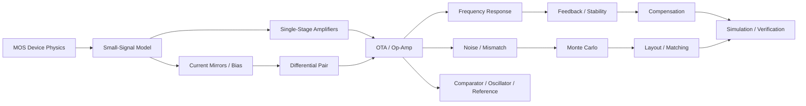
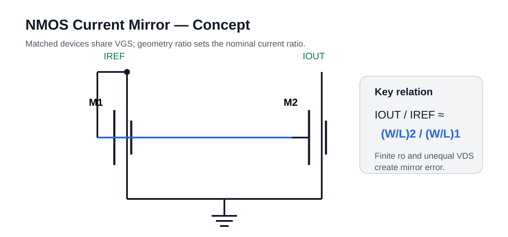
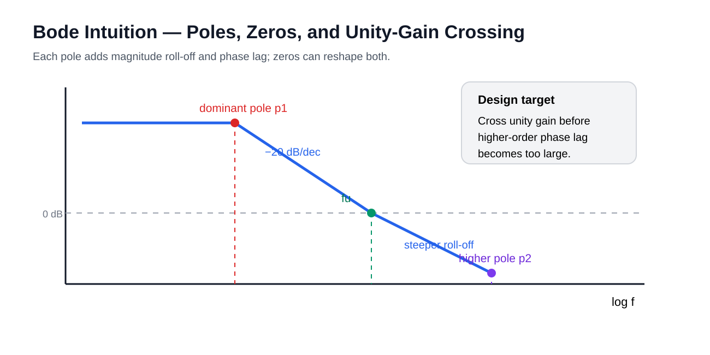

# Analog IC Notes

> Device physics → analog building blocks → amplifiers → feedback → noise → mismatch → layout → verification

A process-independent technical notebook for **analog and mixed-signal IC design**.  
The goal is to connect equations, transistor-level intuition, simulation behavior, and layout-aware design decisions.

This repository reflects my **current primary focus: analog IC design**.

`MOS` · `Analog IC` · `OTA / Op-Amp` · `Feedback` · `Stability` · `Noise` · `Mismatch` · `Layout`

---

## Learning map

## Notes

| # | Topic | Main question |
|---|---|---|
| 01 | [MOS operation](docs/01-mos-operation.md) | What physically creates channel current? |
| 02 | [Small-signal gm / ro / body effect](docs/02-small-signal-gm-ro.md) | Where do gain and output resistance come from? |
| 03 | [Short-channel effects](docs/03-short-channel-effects.md) | Why do DIBL, Vth roll-off and leakage worsen in scaled CMOS? |
| 04 | [Current mirrors & bias](docs/04-current-mirrors-bias.md) | How do we generate reusable analog operating points? |
| 05 | [Single-stage amplifiers](docs/05-single-stage-amplifiers.md) | How do CS / CG / source follower trade gain and impedance? |
| 06 | [Differential pair](docs/06-differential-pair.md) | How does differential voltage become differential current? |
| 07 | [OTA / op-amp architectures](docs/07-opamp-architectures.md) | How do topology choices map to gain, swing, speed and power? |
| 08 | [Frequency response](docs/08-frequency-response.md) | Where do poles and zeros come from? |
| 09 | [Feedback & stability](docs/09-feedback-stability.md) | Why can negative feedback oscillate? |
| 10 | [Compensation](docs/10-compensation.md) | How do Miller compensation and zero control reshape the loop? |
| 11 | [Noise](docs/11-noise.md) | How do thermal and flicker noise enter analog circuits? |
| 12 | [Mismatch & Monte Carlo](docs/12-mismatch-monte-carlo.md) | Why do identical devices disagree in silicon? |
| 13 | [Comparators](docs/13-comparators.md) | How do static and regenerative comparators differ? |
| 14 | [Oscillators](docs/14-oscillators.md) | What sustains oscillation and what sets frequency? |
| 15 | [Voltage references & bandgap](docs/15-voltage-references-bandgap.md) | How are PTAT and CTAT terms combined? |
| 16 | [Layout matching](docs/16-layout-matching.md) | How does physical layout preserve circuit assumptions? |
| 17 | [gm/Id design](docs/17-gmid-design.md) | How can inversion level guide sizing? |
| 18 | [HVMOS / LDMOS](docs/18-high-voltage-mos-ldmos-hvmos.md) | How do high-voltage devices reshape the electric field? |
| 19 | [Simulation methods](docs/19-simulation-methods.md) | What should DC / AC / STB / noise / PVT / MC each prove? |
| 20 | [Analog IC cheat sheet](docs/20-cheatsheet.md) | What equations are worth keeping close? |

---

## Original visual notes

The figures in this repository are original, process-independent vectors stored locally under `assets/figures/` rather than hot-linked third-party images.

<table>
<tr>
<td width="50%" align="center">

 Current mirror · shared VGS and current scaling
</td>
<td width="50%" align="center">

 Bode intuition · dominant pole and unity-gain crossing
</td>
</tr>
</table>

More figures: [Differential pair](docs/06-differential-pair.md) · [Two-stage op-amp](docs/07-opamp-architectures.md) · [Feedback loop](docs/09-feedback-stability.md)

---

## Core philosophy

**1. Bias point first.**  
Small-signal equations are only meaningful after the DC operating point is valid.

**2. Gain is usually \(g_m r_o\) in disguise.**  
Topology changes how many \(g_m\)'s and \(r_o\)'s participate, but the underlying physics remains visible.

**3. Every node stores charge.**  
Frequency response is the interaction of node resistance, capacitance, and controlled-source feedback.

**4. Feedback is a loop, not a block diagram decoration.**  
Loop gain, poles, zeros, delay and loading must all be considered together.

**5. Layout is part of analog design.**  
Mismatch, parasitics, gradients, stress, current density and routing symmetry alter the circuit you actually fabricate.

---

## Scope

Included:
- process-independent analog IC theory;
- original derivations and engineering intuition;
- reusable simulation methodology;
- layout and matching concepts.

Not included:
- foundry PDKs / model cards;
- rule decks / techfiles / layer maps;
- proprietary device data;
- production netlists or restricted screenshots.

For a separate implementation-oriented notebook on DRC / LVS / PEX / post-layout / tape-out, see  
**[Analog-Tapeout-Workflow](https://github.com/CryingXC/Analog-Tapeout-Workflow)**.
