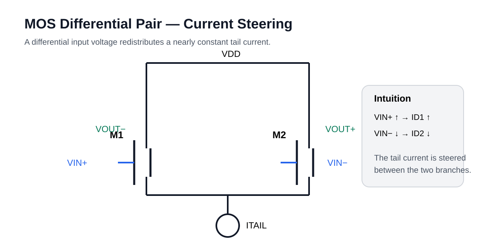

# 06 · Differential Pair

A differential pair converts input difference into current steering.

For a MOS differential pair around zero differential input, the small-signal differential transconductance is approximately related to device \(g_m\).

The key intuition:

- \(v_{id}>0\): one branch takes more tail current;
- \(v_{id}<0\): the other branch takes more;
- large \(|v_{id}|\): nearly all tail current is steered into one side.

## Common-mode range

Input common-mode range is limited by:
- tail current-source compliance;
- input-device saturation;
- active-load headroom.

## CMRR

\[
CMRR = \left|\frac{A_d}{A_{cm}}\right|
\]

Finite tail-source resistance, mismatch and asymmetric loading reduce CMRR.
