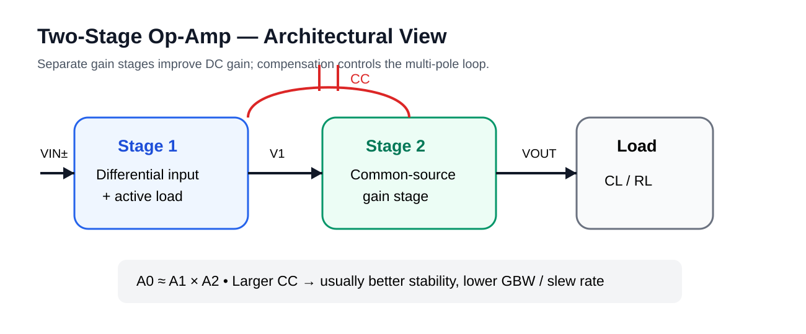

# 07 · OTA / Op-Amp Architectures

## Two-stage op-amp

Typical structure:
1. differential input / first gain stage;
2. second common-source gain stage;
3. Miller compensation capacitor.

Approximate open-loop gain:

\[
A_0 \approx A_1 A_2
\]

Advantages:
- large DC gain;
- large output swing.

Costs:
- multiple high-impedance nodes;
- compensation required;
- slew-rate and settling trade-offs.

## Folded cascode

Advantages:
- high gain in one stage;
- high speed;
- input common-mode flexibility.

Costs:
- more current branches;
- reduced headroom;
- higher design complexity.

## Telescopic cascode

Excellent gain / power efficiency and speed, but limited input and output swing.

## Design metrics

Do not optimize gain alone. Track:
- GBW;
- phase margin;
- slew rate;
- settling;
- input common-mode range;
- output swing;
- noise;
- PSRR / CMRR;
- power.
