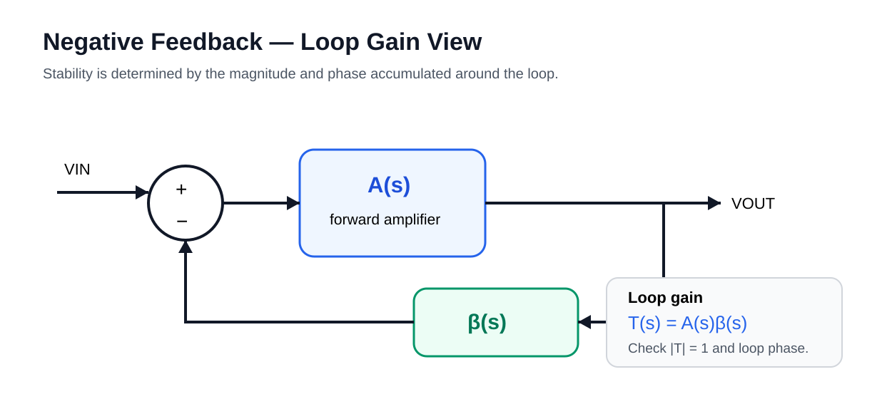

# 09 · Feedback & Stability

Closed-loop transfer:

\[
A_{CL}=\frac{A}{1+A\beta}
\]

Loop gain:

\[
T(s)=A(s)\beta(s)
\]

Negative feedback becomes effectively positive if accumulated loop phase approaches \(-180^\circ\) while \(|T|\ge1\).

## Phase margin

At unity loop gain:

\[
|T(j\omega_u)|=1
\]

\[
PM = 180^\circ + \angle T(j\omega_u)
\]

A larger phase margin usually means less ringing, but excessively conservative compensation reduces bandwidth.

## Gain margin

Measured where loop phase reaches \(-180^\circ\). It indicates how much loop-gain increase can be tolerated before instability.

## Practical checks

- load range;
- output capacitor / ESR range;
- process corners;
- temperature;
- bias current;
- startup state;
- extracted parasitics.
